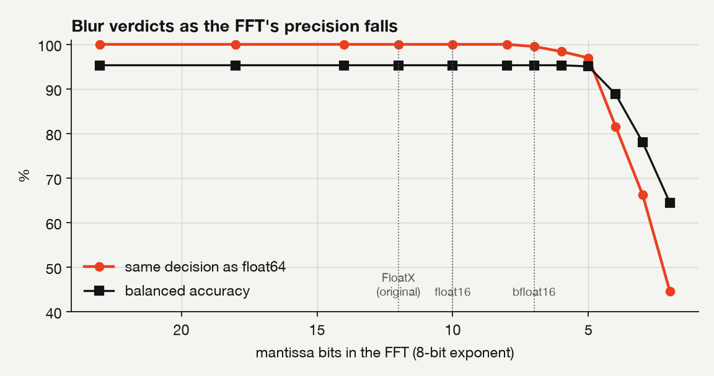
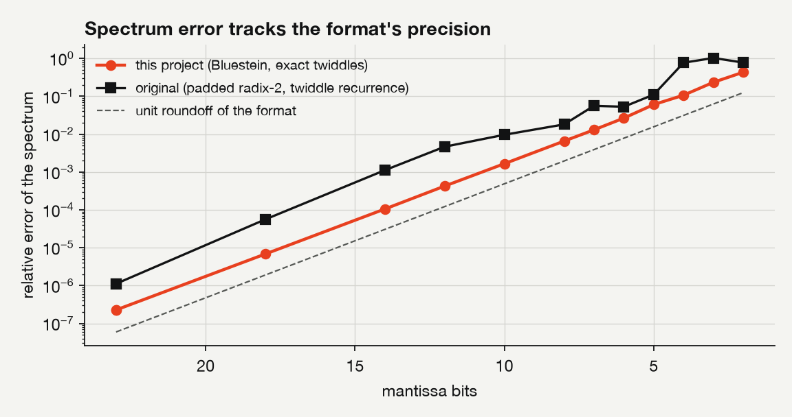

# blurfft

**Image blur detection with approximate FFTs.** It computes the exact
spectrum of an image of any size with Bluestein's FFT, in any floating-point
precision from 64 bits down to formats a few bits wide. From that spectrum it
decides whether the image is blurred, by how much, and whether the blur has
one direction (motion) or none (defocus, or shake in several directions).

```console
$ blurfft analyse photo.jpg --precision float16
photo.jpg: BLURRED (p=1.00; moderate, ~2.7 px, motion at 29 deg) [float16, FFT 2.4 ms]
```

The project began as my final-year project at Queen's University Belfast
(2023-24) and was rebuilt in 2026: an exact Bluestein transform in place of
power-of-two padding, precision that can be chosen at run time, a measured
detector, and a benchmark with ground truth. [`legacy/`](legacy/) keeps the
original code and lists every change.

## Results

All numbers come from the repository's own benchmark: 624 images made from 12
public-domain photographs, blurred by known amounts, with two-fold
cross-validation by photograph. See [docs/results.md](docs/results.md) for
every table.

**Accuracy.** With exposure varied, as in real photographs:

| Method | ROC AUC | Balanced accuracy |
|---|---|---|
| **blurfft** (spectral model) | **0.995** | **0.953** |
| Variance of the Laplacian | 0.968 | 0.884 |
| Tenengrad | 0.894 | 0.772 |
| FFT high-pass (Rosebrock, PyImageSearch) | 0.878 | 0.806 |
| The original project | 0.824 | 0.760 |

With contrast held fixed, the variance of the Laplacian edges ahead (0.991
against 0.986). Its weakness is contrast, which a spectral model can learn to
discount. Beyond the yes/no verdict, blurfft estimates the blur radius (median
error 13%) and the direction of motion blur (median error 2.3 degrees).

**How much precision does blur detection need?** The model is fitted once at
float64, and the FFT then runs at each precision:

| FFT arithmetic | Mantissa bits | Same verdict as float64 | ROC AUC |
|---|---|---|---|
| float64, float32, float16, FloatX (the original's format) | 52 to 10 | 100% | 0.995 |
| 8-bit mantissa | 8 | 100% | 0.995 |
| bfloat16 | 7 | 99.5% | 0.995 |
| 5-bit mantissa | 5 | 97.0% | 0.995 |
| 4-bit mantissa | 4 | 81.6% | 0.993 |
| 2-bit mantissa | 2 | 44.6% | 0.880 |

Blur detection holds to about 5 mantissa bits, so 16-bit formats lose nothing.
At the same format, the rebuilt FFT's error is 4 to 11 times lower than the
original algorithm's, because it rounds its twiddle factors once instead of
compounding them.

<p>
  
  
</p>

**Speed.** On an Apple M2 Max, with all 12 cores, a 720p frame is analysed in
about 11 ms (about 90 per second) and a 1080p frame in about 24 ms (about 40
per second). One core manages about 17 per second at 720p. float32 runs about
20% faster than float64. float16 halves the memory again, to 4.2 MB for a
1080p spectrum.

Two things these numbers do not show:

- numpy's pocketfft is faster on one core: it uses mixed-radix transforms and
  SIMD, where blurfft uses Bluestein for every length that is not a power of
  two, and keeps every operation's rounding under control.
- Energy is not measured, because macOS shows power counters only to root. On
  Linux, `blurfft benchmark` reads the RAPL counters when it can.

**Real photographs.** The sample images from the original project
([`examples/`](examples/)), with my own reading of each:

| Image | blurfft says | By eye |
|---|---|---|
| test1: a hand against a city skyline | blurred, about 2.2 px, no single direction | out of focus throughout |
| test2: Notre-Dame at night | blurred, about 1.9 px | heavy camera shake |
| test3: a skateboarder | sharp | sharp subject, background streaked by panning |
| test4: a street crowd | blurred, motion | long-exposure motion blur |
| test5: two friends at night | partly blurred (38% of the picture) | sharp subjects, streaked lights behind |
| test6: a mountain lake | sharp | sharp |
| test7: a cat | sharp | pixelated, not blurred |

Notre-Dame is caught by the region rule: its black sky carries no detail, so
the tiles that can be judged decide. On the whole image alone, the probability
is only 0.34.

## Quick start

```bash
pip install .                 # builds the C++ core (needs a C++17 compiler and CMake 3.18+)
pip install ".[bench]"        # also the benchmark's photographs and plotting
```

```bash
blurfft analyse photos/                 # every image in a folder
blurfft analyse photo.jpg --json        # the full report
blurfft map photo.jpg                   # a blur map for a partly blurred photo
blurfft compare photo.jpg               # the same image at eight precisions
blurfft formats                         # the precision formats
blurfft gui                             # drag and drop in your browser (served locally)
```

```python
from blurfft import BlurDetector

report = BlurDetector(precision="bfloat16").analyse("photo.jpg")
report.verdict, report.probability, report.severity, report.sigma, report.blur_type

blur_map = BlurDetector().map("photo.jpg")  # probability per tile
```

Precisions are named `float64`, `float32` and `float16` (hardware arithmetic),
`bfloat16`, `floatx` (the original project's format), or `eXmY` for any
emulated format with X exponent bits and Y mantissa bits, such as `e5m10` or
`e8m4`.

The FFT can be used on its own:

```python
import numpy as np
import blurfft

blurfft.fft(x, precision="e8m12")            # exact DFT of any length, in FloatX arithmetic
blurfft.rfft2(image, precision="float16")    # numpy.fft.rfft2's layout, in half precision
```

## How it works

[docs/method.md](docs/method.md) has the details. In outline:

1. **Bluestein's FFT** turns a DFT of any length into a convolution with a
   chirp, which is computed with power-of-two FFTs. The result is the exact
   DFT of the image as it is, with no padding.
2. **Exact scaling.** Every stage rescales by powers of two, which adds no
   rounding error and keeps float16 in range on 1080p frames.
3. **Real-input FFT.** Two rows go through one complex transform, and only the
   half-plane is computed, so each pass does half the work. Rows, columns and
   measures are split across threads.
4. **Precision.** Hardware formats are used for speed. Any other format is
   emulated with correct rounding on every operation, and the emulated float32
   and float16 are bit-for-bit identical to the hardware ones.
5. **Detection.** For seven radial frequency bands, the model looks at each
   band's spectral density and its density in the weakest direction (motion
   blur hides in one direction).
   - A logistic regression on those features gives the probability of blur,
     and a ridge regression gives the radius.
   - Tiles back up the verdict where dark or empty areas would dilute it.
   - The spectrum's structure tensor gives the motion direction.

   The model is FFT only, with no neural network, and is small enough to read
   in [`model.json`](src/blurfft/model.json).

## The plan, requirement by requirement

| Requirement in the project plan | How it is met | Evidence |
|---|---|---|
| Image blur detection: presence and severity | Verdict (sharp, partly blurred, blurred), probability, radius, severity class, blur type and direction, blur maps | [results](docs/results.md), `tests/test_detector.py` |
| Bluestein's FFT for arbitrary lengths | Chirp-z transform for every length that is not a power of two | `cpp/tests`: every length from 1 to 200 and primes up to 1283, against a direct DFT |
| Approximate computing, reduced precision | float64, float32, float16 in hardware; any `eXmY` format emulated | the precision table above |
| Adjustable precision | `--precision` and `BlurDetector(precision=...)` at run time | `blurfft compare` |
| Real time | 720p at about 90 frames per second, 1080p at about 40, on 12 cores | [speed](docs/results.md#speed) |
| Scalability | Any image size, primes included; tiles of any size; features independent of size | the benchmark's crops run from 128 to 768 px |
| Performance analysis | `blurfft benchmark`: time, memory, error, and energy where available | `results/performance.json` |
| Accuracy against ground truth | Labelled benchmark, cross-validated by photograph | `results/evaluation.json` |
| Comparison with existing methods | Laplacian, Tenengrad, FFT high-pass (Rosebrock), the original | the accuracy table above |

## Reproduce

```bash
pip install ".[bench,test]"
pytest                                   # 83 Python tests
cmake -S . -B build && cmake --build build && ctest --test-dir build   # 254 C++ checks
blurfft evaluate --out results           # about 6 minutes on 12 cores
blurfft benchmark --out results          # about 3 minutes
blurfft report --results results --out docs
```

`blurfft evaluate --fit` refits the shipped model.

## Layout

```
cpp/include/blurfft/   the C++17 core, header-only: precision, fft, fft2d, metrics, analysis
cpp/python/            pybind11 bindings
cpp/tests/             C++ tests
src/blurfft/           the Python package: detector, model, benchmark, evaluation, CLI, GUI
tests/                 Python tests
docs/                  method, results and figures
results/               the JSON results behind docs/results.md
examples/              sample images
legacy/                the original implementation, kept for comparison
```

## Acknowledgements

The benchmark's photographs come from scikit-image's sample data, which are
public domain or CC0. Their licences are listed in `blurfft.dataset.SOURCES`.
FloatX (Tagliavini et al.) inspired the emulated formats, and the
supervisor's guidance is kept in [`legacy/Notes.txt`](legacy/Notes.txt).
