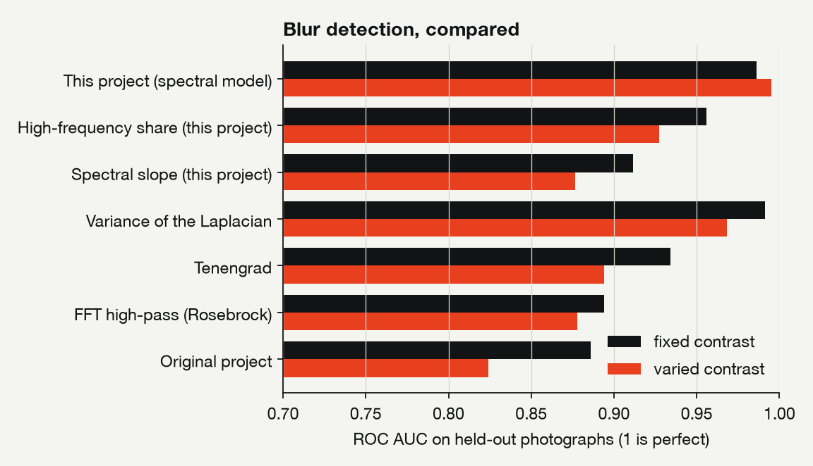
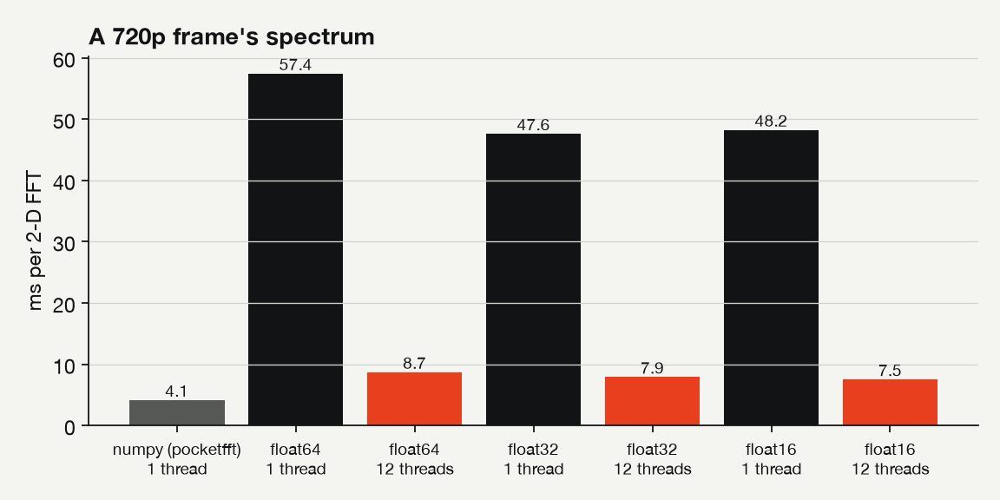

# Results

Generated by `blurfft evaluate` and `blurfft benchmark`, then `blurfft report`. Every number below comes from those runs; rerun them to reproduce or update this page.

Measured on Apple M2 Max (12 cores), Darwin arm64, Python 3.11.9; hardware float16: yes.

## Detection accuracy

624 images from 12 public-domain photographs: 96 sharp, 384 blurred, 144 in the borderline band (equivalent blur radius between 0.5 and 1.5 px) that are left out of the sharp/blurred scores. Two-fold cross-validation by photograph: no test image shares a photograph with a training image.

### Fixed contrast

| Method | ROC AUC | Balanced accuracy | Rank correlation with blur radius |
|---|---|---|---|
| This project (spectral model) | 0.986 | 0.926 | 0.70 |
| High-frequency share (this project) | 0.956 | 0.870 | 0.46 |
| Spectral slope (this project) | 0.912 | 0.859 | 0.05 |
| Variance of the Laplacian | 0.991 | 0.943 | 0.68 |
| Tenengrad | 0.934 | 0.812 | 0.68 |
| FFT high-pass (Rosebrock) | 0.894 | 0.777 | 0.58 |
| Original project | 0.886 | 0.827 | 0.24 |

### Varied contrast (0.35 to 1)

| Method | ROC AUC | Balanced accuracy | Rank correlation with blur radius |
|---|---|---|---|
| This project (spectral model) | 0.995 | 0.953 | 0.73 |
| High-frequency share (this project) | 0.927 | 0.859 | 0.42 |
| Spectral slope (this project) | 0.877 | 0.835 | 0.08 |
| Variance of the Laplacian | 0.968 | 0.884 | 0.64 |
| Tenengrad | 0.894 | 0.772 | 0.60 |
| FFT high-pass (Rosebrock) | 0.878 | 0.806 | 0.57 |
| Original project | 0.824 | 0.760 | 0.23 |

## How much precision does blur detection need?

The model is fitted once at float64; the FFT then runs at each precision. "Same decision" is the share of images whose sharp/blurred verdict matches float64.

| Format | Mantissa bits | Arithmetic | ROC AUC | Balanced accuracy | Same decision | Mean change in probability |
|---|---|---|---|---|---|---|
| float64 | 52 | hardware | 0.995 | 0.953 | 100.0% | 0.0000 |
| e8m23 | 23 | emulated | 0.995 | 0.953 | 100.0% | 0.0000 |
| float32 | 23 | hardware | 0.995 | 0.953 | 100.0% | 0.0000 |
| e8m18 | 18 | emulated | 0.995 | 0.953 | 100.0% | 0.0000 |
| e8m14 | 14 | emulated | 0.995 | 0.953 | 100.0% | 0.0000 |
| e8m12 | 12 | emulated | 0.995 | 0.953 | 100.0% | 0.0000 |
| e8m10 | 10 | emulated | 0.995 | 0.953 | 100.0% | 0.0001 |
| float16 | 10 | hardware | 0.995 | 0.953 | 100.0% | 0.0001 |
| e8m8 | 8 | emulated | 0.995 | 0.953 | 100.0% | 0.0009 |
| e8m7 | 7 | emulated | 0.995 | 0.953 | 99.5% | 0.0038 |
| e8m6 | 6 | emulated | 0.995 | 0.953 | 98.4% | 0.0141 |
| e8m5 | 5 | emulated | 0.995 | 0.951 | 97.0% | 0.0353 |
| e8m4 | 4 | emulated | 0.993 | 0.888 | 81.6% | 0.1753 |
| e8m3 | 3 | emulated | 0.968 | 0.780 | 66.2% | 0.3312 |
| e8m2 | 2 | emulated | 0.880 | 0.645 | 44.6% | 0.5277 |

## Severity and blur type

* Blur radius estimate: median relative error 13%, rank correlation 0.89 with the true radius (blurred images).
* Motion blur against defocus: balanced accuracy 0.80; median error in the motion direction 2.3 degrees.

## Speed

Median of repeated runs. Analysis is the FFT plus the measures; fps is analyses per second.

| Frame | Precision | Threads | FFT (ms) | Analysis (ms) | fps |
|---|---|---|---|---|---|
| 480p (640 x 480) | numpy pocketfft (float64) | 1 | 1.12 | - | 889 |
| 480p (640 x 480) | float64 | 1 | 15.83 | 19.40 | 52 |
| 480p (640 x 480) | float64 | 12 | 2.99 | 4.26 | 235 |
| 480p (640 x 480) | float32 | 1 | 13.26 | 16.89 | 59 |
| 480p (640 x 480) | float32 | 12 | 2.52 | 3.67 | 272 |
| 480p (640 x 480) | float16 | 1 | 13.59 | 17.14 | 58 |
| 480p (640 x 480) | float16 | 12 | 2.71 | 3.67 | 272 |
| 720p (1280 x 720) | numpy pocketfft (float64) | 1 | 4.14 | - | 241 |
| 720p (1280 x 720) | float64 | 1 | 57.41 | 68.02 | 15 |
| 720p (1280 x 720) | float64 | 12 | 8.69 | 12.81 | 78 |
| 720p (1280 x 720) | float32 | 1 | 47.59 | 58.06 | 17 |
| 720p (1280 x 720) | float32 | 12 | 7.90 | 11.45 | 87 |
| 720p (1280 x 720) | float16 | 1 | 48.22 | 58.76 | 17 |
| 720p (1280 x 720) | float16 | 12 | 7.51 | 10.96 | 91 |
| 1080p (1920 x 1080) | numpy pocketfft (float64) | 1 | 10.11 | - | 99 |
| 1080p (1920 x 1080) | float64 | 1 | 130.23 | 154.84 | 6 |
| 1080p (1920 x 1080) | float64 | 12 | 19.14 | 27.96 | 36 |
| 1080p (1920 x 1080) | float32 | 1 | 109.25 | 132.73 | 8 |
| 1080p (1920 x 1080) | float32 | 12 | 17.14 | 23.63 | 42 |
| 1080p (1920 x 1080) | float16 | 1 | 108.64 | 132.21 | 8 |
| 1080p (1920 x 1080) | float16 | 12 | 16.27 | 24.03 | 42 |
| 1024 x 1024 | numpy pocketfft (float64) | 1 | 4.66 | - | 214 |
| 1024 x 1024 | float64 | 1 | 10.16 | 22.29 | 45 |
| 1024 x 1024 | float64 | 12 | 2.20 | 6.16 | 162 |
| 1024 x 1024 | float32 | 1 | 8.86 | 20.82 | 48 |
| 1024 x 1024 | float32 | 12 | 2.19 | 6.01 | 166 |
| 1024 x 1024 | float16 | 1 | 9.53 | 21.52 | 46 |
| 1024 x 1024 | float16 | 12 | 2.15 | 5.93 | 169 |
| 1009 x 997 (primes) | numpy pocketfft (float64) | 1 | 27.38 | - | 37 |
| 1009 x 997 (primes) | float64 | 1 | 43.66 | 54.08 | 18 |
| 1009 x 997 (primes) | float64 | 12 | 6.86 | 10.68 | 94 |
| 1009 x 997 (primes) | float32 | 1 | 35.57 | 47.00 | 21 |
| 1009 x 997 (primes) | float32 | 12 | 6.03 | 9.56 | 105 |
| 1009 x 997 (primes) | float16 | 1 | 36.17 | 47.64 | 21 |
| 1009 x 997 (primes) | float16 | 12 | 6.20 | 9.54 | 105 |

## The cost of an exact transform

Padding to powers of two (the original project's approach) is cheaper: one power-of-two transform per row, where Bluestein runs two of at least twice the length. But it transforms a different, larger image, so the spectrum changes with the padding. Bluestein buys the exact DFT of the true image for about twice the time.

| Frame | Exact, Bluestein (ms) | Padded to | Padded (ms) | Extra pixels |
|---|---|---|---|---|
| 480p (640 x 480) | 2.88 | 1024 x 512 | 1.24 | 71% |
| 720p (1280 x 720) | 9.00 | 2048 x 1024 | 4.48 | 128% |
| 1080p (1920 x 1080) | 19.26 | 2048 x 2048 | 9.05 | 102% |
| 1024 x 1024 | 2.28 | 1024 x 1024 | 2.23 | 0% |
| 1009 x 997 (primes) | 7.00 | 1024 x 1024 | 2.34 | 4% |

## Memory

The half-plane spectrum of a 1080p frame in each format, packed at the format's width.

| Format | Spectrum |
|---|---|
| float64 | 16.6 MB |
| float32 | 8.3 MB |
| float16 | 4.2 MB |

## Energy

Not measured on this machine: macOS exposes power counters only to root. On Linux, `blurfft benchmark` reads the RAPL counters when they are readable.

## Figures

